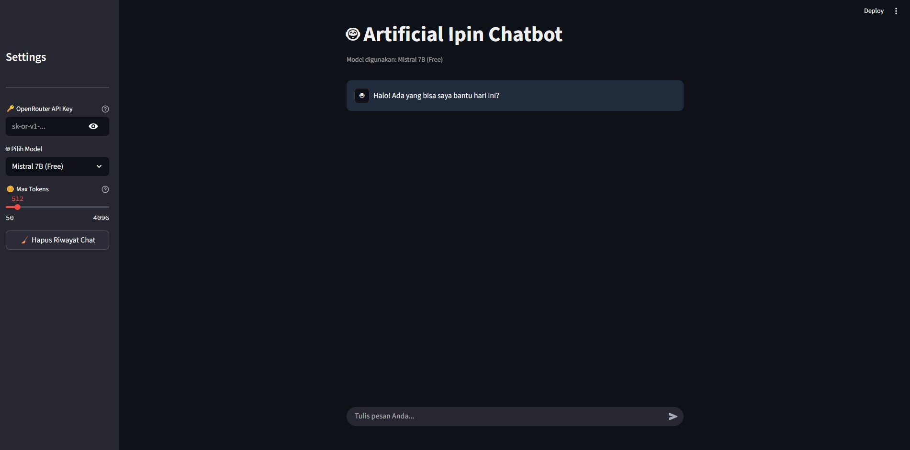

# Artificial Ipin Chatbot

Artificial Ipin Chatbot adalah aplikasi chatbot interaktif berbasis Streamlit yang memanfaatkan layanan OpenRouter API dan model LLM (Large Language Models) seperti Claude, Gemini, LLaMA, dan lainnya. Chatbot ini dirancang dengan antarmuka yang modern, gelap, dan intuitif .

## Fitur Utama

* 🔐 Masukkan API Key dari OpenRouter
* 🤖 Pilih model AI dari berbagai penyedia (Anthropic, Google, Meta, Mistral)
* 🎛️ Atur panjang maksimal respons AI (max tokens)
* 🧹 Reset histori chat
* 💬 Chat UI modern dan gelap dengan pesan berbentuk bubble

## Tampilan Antarmuka



## Cara Menjalankan

### 1. Persiapan Lingkungan

Pastikan Anda sudah menginstal Python 3.8 atau lebih tinggi.

### 2. Instalasi Paket

```bash
pip install streamlit requests
```

### 3. Jalankan Aplikasi

```bash
streamlit run app.py
```

## Panduan Penggunaan

1. Masukkan API key dari [OpenRouter](https://openrouter.ai/keys)
2. Pilih model AI yang ingin digunakan dari dropdown
3. Atur jumlah maksimal token untuk respons
4. Ketik pertanyaan atau perintah Anda di kotak input
5. Tekan Enter dan lihat respons AI

## Model yang Didukung

* Mistral 7B (Free)
* Llama 3 8B (Free)
* Claude 3.5 Sonnet
* Google Gemini Pro

## Struktur Proyek

```
├── app.py         # File utama aplikasi Streamlit
├── README.md          # Dokumentasi proyek
├── docs/
│   └── ui_chatbot.jpg # Gambar antarmuka
```

## Catatan Tambahan

* Chatbot ini menggunakan sesi pengguna lokal (tidak ada database)

---
